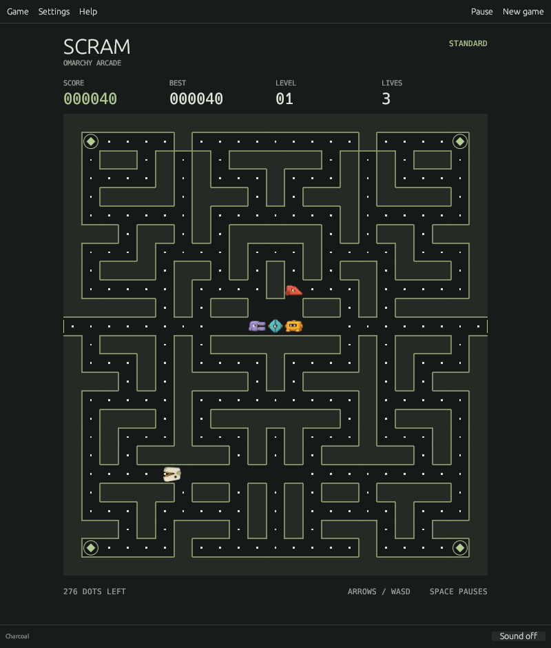

# Omarchy Scram

An original maze chase for **Omarchy Arcade**. Clear the dots, turn the tables
with power diamonds, and survive four pursuers with different tactics.

Native Rust, offline, no accounts. Community project; not an official Omarchy
or PAC-MAN release. Code, maze, artwork and synthesized cues are original and
MIT licensed. Dependency notices are in `THIRD_PARTY_LICENSES.txt`.



## Install an Arch preview

Open [Native checks](https://github.com/tcballard/omarchy-scram/actions/workflows/ci.yml)
and choose the latest successful run for the preview branch. Download the
`arch-package` artifact, extract its ZIP, then run:

```sh
sudo pacman -U ./omarchy-scram-*.pkg.tar.zst
```

GitHub requires sign-in to download workflow artifacts. Preview builds are
unreleased; native Omarchy desktop playtesting is still needed. To build from
source instead, see the makepkg instructions below.

## Play the Linux bundle

On your x86_64 Omarchy machine, extract the Linux bundle and run:

```sh
./omarchy-scram
```

To add it to your app launcher for the current user:

```sh
sh install.sh
```

Re-run the installer from a newer bundle to update. Saves are preserved. This
preview was built on Linux x86_64 and requires glibc 2.39 or newer, OpenGL,
libxkbcommon and a Wayland or X11 desktop. A real Omarchy desktop acceptance
pass is still required. See `docs/VERIFICATION.md` for the checks performed.

## Updating from the Munch preview

The game is now **Omarchy Scram**. Run the new portable installer to replace
its launcher entry. The command is `omarchy-scram`; a compatibility shortcut
keeps `omarchy-munch` working. `SCRAM_INSTALL_PREFIX` selects an alternative
installation prefix; the earlier `MUNCH_INSTALL_PREFIX` is also accepted.

Existing saves, high scores, settings and character packs stay in their
original `omarchy-munch` data directories. No files need moving, and both
versions use the same save lock. The Arch package declares that it replaces
`omarchy-munch`. Latch remains the default character pack's name.

## Change the characters

**Latch** is the default: an ivory hinged jaw and four mechanical pursuers.
Open **Settings → Characters** to switch to Original or an installed pack.
Switching never resets the current run, difficulty or high scores.

Choose **Create editable copy**, then **Open packs folder**. Replace the PNGs
inside `my-characters`, edit `pack.toml` if the layout changes, click **Reload
packs**, and select **My characters**. No Rust tools or rebuild needed.
Transparent PNGs work directly; colour-key PNGs are also supported.

See [the artwork pack guide](docs/ARTWORK-PACKS.md) for the complete format,
limits, reload behaviour and a command to validate a pack before opening it.

## Controls

| Action | Keys |
| --- | --- |
| Move | Arrow keys, WASD or HJKL |
| Pause / resume | Space, P or Esc |
| New game | Ctrl+N |
| Settings | Ctrl+, |
| Sound | Ctrl+M |
| Help | F1 |
| Save and quit | Ctrl+Q |

Choose a direction to begin. Turns are buffered until a junction; reversing
works immediately. The side tunnel wraps to the opposite edge. Menus, dialogs
and loss of window focus pause play; resume explicitly with Space.

Dots score 10 and power diamonds score 50. During power, captures score 200,
400, 800 and 1,600. An extra life arrives every 10,000 points, up to nine lives.
Clear the maze to advance. Speed increases and power duration decreases to
bounded limits. The power bar is an exact countdown, with no flashing.

Relaxed mode is 25% slower and keeps its own best score. Select it in Settings
before starting a new run. Sound is off initially. Optional original cues mark
power, captures, lost lives and cleared levels; `paplay` from Arch's `libpulse`
package supplies playback. There is no music and no sound needed to play.

## Build and install an Arch package

From the extracted **source** directory, with Rust and base-devel installed:

```sh
makepkg -si
```

The checked-in PKGBUILD builds, tests and packages the native executable,
desktop entry, icon and licences. Run makepkg as your normal user. Updates:

```sh
sudo pacman -U ./omarchy-scram-*.pkg.tar.zst
```

Do not install the portable user launcher and the pacman version together;
remove the portable launcher files if switching to pacman:
`~/.local/bin/omarchy-scram`, `~/.local/bin/omarchy-munch`,
`~/.local/share/applications/io.github.tcballard.omarchy-scram.desktop`, and
`~/.local/share/icons/hicolor/128x128/apps/io.github.tcballard.omarchy-scram.png`.
Saved games are independent of the installation.

## Development

Rust 1.98 or newer. Linux development packages: EGL/OpenGL, Wayland, X11 and
libxkbcommon. The renderer is eframe/egui with both Wayland and X11 enabled.

```sh
cargo fmt --check
cargo clippy --locked --all-targets -- -D warnings
cargo test --locked
cargo run --locked --release
```

Native screenshot (with an active desktop, or under xvfb-run):

```sh
omarchy-scram --state-dir /tmp/scram-preview --screenshot preview.png
```

`--state-dir` isolates saves for testing. `--width` and `--height` support
capture sizes down to 560 × 620. `--help` lists the CLI.

## Settings and recovery

The session, settings and both high scores live in
`$XDG_STATE_HOME/omarchy-munch/session.json`, defaulting to
`~/.local/state/omarchy-munch/session.json`. Writes use a synchronized temporary
file and atomic rename. A process lock prevents two windows from overwriting
one save. A run opens paused after resuming; new games wait for a direction.

New Game preserves the preceding session in `previous-session.json`. Damaged
save files are retained with a `session-damaged-…` name. Unreadable files and
unknown format versions put the app in a visible, non-saving mode. To recover
the previous run, close the app and back up the current session before copying
`previous-session.json` to `session.json`.

Follow Omarchy is the default. It reads `colors.toml` under
`$XDG_STATE_HOME/omarchy/current/theme` (normally `~/.local/state`) and checks
the legacy `$XDG_CONFIG_HOME/omarchy/current/theme` path as a fallback. Theme
files are read only and polled every two seconds. Invalid themes use a readable
fallback. Charcoal and Ivory palettes can be selected independently.

Text, pellets and wall edges are contrast checked. Original vector characters
follow the palette; artwork packs retain their authored colours. Pursuer silhouettes
and frightened expressions supplement colour; a Reduce animation option
removes chewing and death shrinking. Standard widgets expose accessibility
semantics and the board has a status summary. This fast spatial game has not
been validated for screen-reader-only play.
